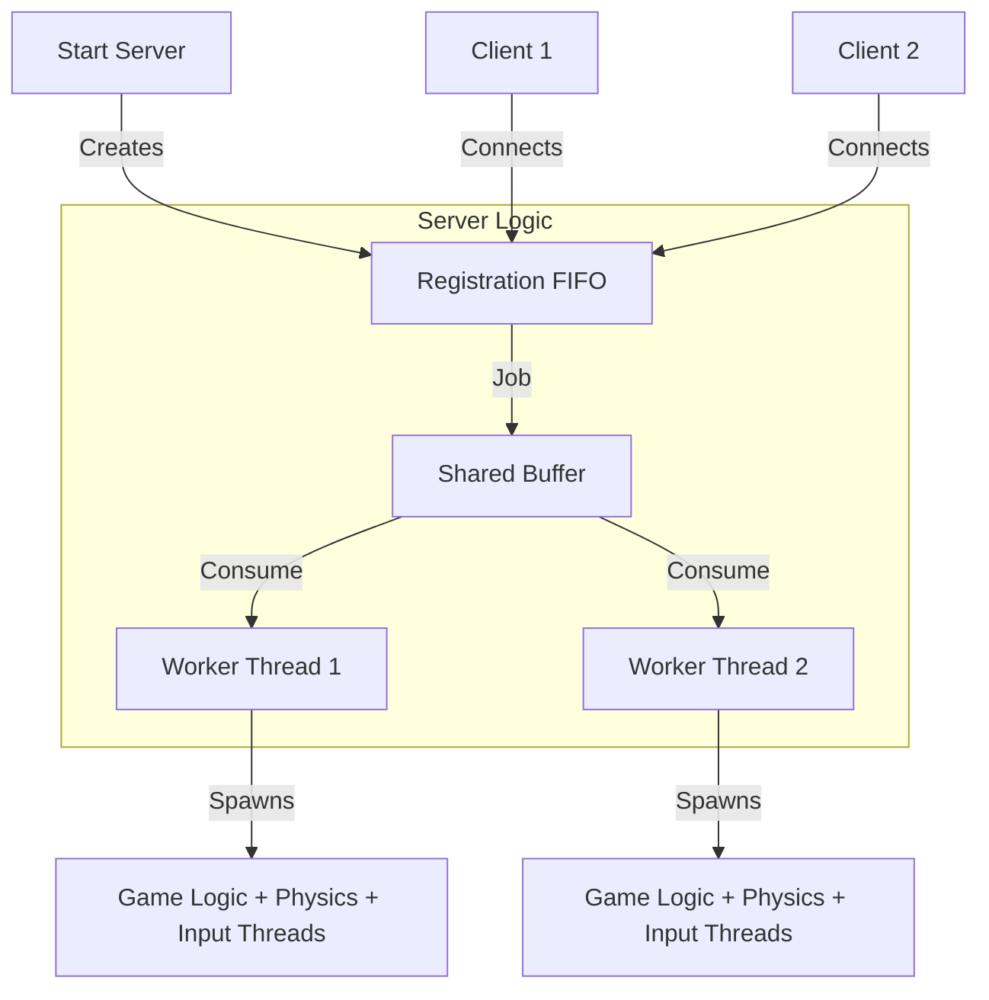

# PacmanIST: Multi-Client Game Server

<p align="center">
  
  
  
</p>

## Overview
PacmanIST is a robust multi-client game server developed for the **Operating Systems (SO)** course at **Instituto Superior Técnico**. It enables multiple players to play Pacman simultaneously via a **Client-Server** architecture.

The project demonstrates advanced OS concepts including:
- **Multithreading** (Producer-Consumer pattern with Worker Threads)
- **Inter-Process Communication (IPC)** using Named Pipes (FIFOs)
- **Synchronization** (Mutexes, Semaphores)
- **Signal Handling** (Graceful shutdowns, seamless logging)

---

## 🏗️ Architecture

The system is built on a modular Client-Server model:



### Key Components
1.  **Main Server Thread (Host Task):** Listens for new connections and delegates them to a job queue.
2.  **Worker Threads:** Pick up game sessions and manage the game lifecycle.
3.  **Dedicated Game Threads:** Each game spawns separate threads for:
    *   Pacman movement
    *   Ghost AI
    *   board state updates (sent to client)
    *   Input handling

---

## 🚀 Getting Started

### Prerequisites
*   GCC Compiler
*   Make
*   Ncurses library (`libncurses-dev`)

### Installation

Clone the repository and build the project:
```bash
git clone https://github.com/aireschichava/OS_Pacman.git
cd OS_Pacman/Project_2
make clean && make
```

---

## 🎮 How to Run

### 1. Start the Server
The server manages the game state and physics.
```bash
# Usage: ./bin/PacmanIST <levels_dir> <max_games> <fifo_name>
./bin/PacmanIST levels 3 /tmp/pacman_server
```

### 2. Start a Client
Clients render the game board and send player inputs.
```bash
# Usage: ./bin/client <player_id> <fifo_name>
./bin/client player1 /tmp/pacman_server
```

### Controls
| Key | Action |
|:---:|:---|
| `W` | Move Up ⬆️ |
| `A` | Move Left ⬅️ |
| `S` | Move Down ⬇️ |
| `D` | Move Right ➡️ |
| `Q` | Quit Game ❌ |

---

## 🧪 Testing & features

### Signal Handling
*   **SIGUSR1:** Logs usage statistics (Top scores) to `score_log.txt` without stopping the server.
*   **SIGINT (Ctrl+C):** Initiates a graceful shutdown, cleaning up all FIFOs and memory.
*   **SIGPIPE:** Handled to ensure the server keeps running even if a client disconnects unexpectedly.

### Automated Tests
Run the full test suite to verify system stability:
```bash
chmod +x run_all_tests.sh
./run_all_tests.sh
```

---

## 👥 Authors

*   **Aires Chichava**
*   **Eric Muthami**

---
*Disclaimer: This project was developed for the Operating Systems course at IST (2025/2026).*
